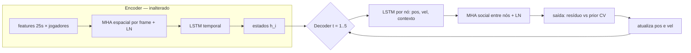

```{r setup, message=FALSE, warning=FALSE}
library(torch)
library(tidyverse)
library(ggsoccer)
library(R6)
library(here)
library(readr)
library(ggforce)

source(here("src", "modeling.R"))
```

```{r reproducibility-device}
# ==========================================
# 0. REPRODUTIBILIDADE & CONFIGURAÇÃO DO DISPOSITIVO
# ==========================================
set_seed <- function(seed = 42) {
  set.seed(seed)
  torch_manual_seed(seed)
}

get_device <- function() {
  if (cuda_is_available()) {
    return(torch_device("cuda"))
  } else if (backends_mps_is_available()) {
    return(torch_device("mps"))
  } else {
    return(torch_device("cpu"))
  }
}
```

# 1. Pré-processamento e Construção de Grafos

O pipeline de pré-processamento é idêntico ao do baseline (`old.qmd`): janelas de 30 s
centradas em finalizações de jogo aberto no meio-campo ofensivo, orientação normalizada
(ataque → direita), 25 frames observados + 5 frames alvo, todos os jogadores de linha.
Acrescenta-se apenas a opção `augment_mirror` (usada no experimento E3).

```{r data-preprocessing}
# Função de colação customizada para lotes de tamanho 1 (preserva tipos e metadados R)
custom_collate <- function(batch) {
  batch[[1]]
}

# Espelhamento lateral exato y -> 68 - y no espaço z-scoreado:
# y'_s = (68 - 2*mu_y)/sd_y - y_s  (a média/desvio do scaler NÃO se alteram)
mirror_graph <- function(g, scaler) {
  a_y     <- (68 - 2 * scaler$center["y"])     / scaler$scale["y"]
  a_yball <- (68 - 2 * scaler$center["y_ball"]) / scaler$scale["y_ball"]
  a_vely  <- (0  - 2 * scaler$center["vel_y"])  / scaler$scale["vel_y"]

  g2 <- g
  g2$x_cont <- g$x_cont$clone()
  g2$x_cont[, , 2] <- a_y     - g2$x_cont[, , 2]   # y
  g2$x_cont[, , 5] <- a_yball - g2$x_cont[, , 5]   # y_ball
  g2$x_cont[, , 8] <- a_vely  - g2$x_cont[, , 8]   # vel_y
  g2$y <- g$y$clone()
  g2$y[, , 2] <- a_y - g2$y[, , 2]
  g2
}

preprocess_and_build_dataset <- function(df, 
                                         train_prop = 0.60, 
                                         val_prop = 0.15, 
                                         calib_prop = 0.15, 
                                         seed = 42,
                                         augment_mirror = FALSE) {
  set.seed(seed)
  df <- as.data.frame(df)

  # 1. Codificação Categórica Robusta
  # team_code ("Attack" / "Defense") indica o papel tático na posse
  df <- df %>%
    mutate(
      role_idx = if_else(team_code == "Attack", 2L, 1L), # 1 = Defense, 2 = Attack
      team_id_idx = as.integer(as.factor(team_id))
    ) %>% 
    group_by(player_id, event_id) %>%
    arrange(time_sec) %>%
    mutate(
      dist_to_ball = sqrt((x - x_ball)^2 + (y - y_ball)^2),
      vel_x = x - lag(x, default = first(x)),
      vel_y = y - lag(y, default = first(y))
    ) %>%
    ungroup()

  encoders <- list(
    num_teams = max(df$team_id_idx, na.rm = TRUE),
    num_roles = 2L
  )

  # 2. Particionamento por Jogada Independente (Sem Vazamento de Dados)
  unique_events <- unique(df$event_id)
  n_events <- length(unique_events)
  shuffled_events <- sample(unique_events)

  n_train <- floor(train_prop * n_events)
  n_val <- floor(val_prop * n_events)
  n_calib <- floor(calib_prop * n_events)

  train_events <- shuffled_events[1:n_train]
  val_events <- shuffled_events[(n_train + 1):(n_train + n_val)]
  calib_events <- shuffled_events[(n_train + n_val + 1):(n_train + n_val + n_calib)]
  test_events <- shuffled_events[(n_train + n_val + n_calib + 1):n_events]

  # 3. Escalonamento Estatístico Estrito (Ajustado APENAS no Treino, t <= 25)
  cont_cols <- c('x', 'y', 'ball_speed', 'x_ball', 'y_ball', 'dist_to_ball', 'vel_x', 'vel_y')
  train_obs <- df %>% filter(event_id %in% train_events, time_sec <= 25)

  scaler_center <- colMeans(train_obs[, cont_cols], na.rm = TRUE)
  scaler_scale <- apply(train_obs[, cont_cols], 2, sd, na.rm = TRUE)
  scaler_scale[scaler_scale == 0] <- 1

  # Padronização z-score das variáveis contínuas
  df[, cont_cols] <- scale(df[, cont_cols], center = scaler_center, scale = scaler_scale)

  # 4. Construção dos Grafos por Jogada
  event_list <- df %>% group_split(event_id)
  graphs <- list()

  for (event_df in event_list) {
    evt_id <- event_df$event_id[1]

    obs_df <- event_df %>% filter(time_sec <= 25)
    target_df <- event_df %>% filter(time_sec >= 26 & time_sec <= 30)

    obs_counts <- table(obs_df$player_id)
    target_counts <- table(target_df$player_id)

    # Identificar jogadores presentes em todos os 25 frames observados e 5 alvos
    valid_players <- names(obs_counts)[obs_counts == 25]
    valid_players <- valid_players[valid_players %in% names(target_counts)]
    valid_players <- valid_players[target_counts[valid_players] == 5]
    valid_players <- sort(valid_players)

    if (length(valid_players) < 2) next

    node_features_seq <- list()
    node_cat_features <- list()
    node_targets_seq <- list()
    node_player_ids <- character()
    node_team_codes <- character()
    node_team_names <- character()

    for (pid in valid_players) {
      p_obs <- obs_df %>% filter(player_id == pid) %>% arrange(time_sec)
      p_tgt <- target_df %>% filter(player_id == pid) %>% arrange(time_sec)

      node_features_seq[[length(node_features_seq) + 1]] <- as.matrix(p_obs[, cont_cols])
      node_cat_features[[length(node_cat_features) + 1]] <- as.integer(p_obs[1, c('team_id_idx', 'role_idx')])
      node_targets_seq[[length(node_targets_seq) + 1]] <- as.matrix(p_tgt[, c('x', 'y')])

      node_player_ids <- c(node_player_ids, pid)
      node_team_codes <- c(node_team_codes, p_obs$team_code[1])
      node_team_names <- c(node_team_names, p_obs$team_name[1])
    }

    x_cont <- torch_tensor(abind::abind(node_features_seq, along = 0), dtype = torch_float())
    x_cat <- torch_tensor(do.call(rbind, node_cat_features), dtype = torch_long())
    y_tgt <- torch_tensor(abind::abind(node_targets_seq, along = 0), dtype = torch_float())

    graphs[[length(graphs) + 1]] <- list(
      x_cont = x_cont, 
      x_cat = x_cat, 
      y = y_tgt, 
      num_nodes = length(valid_players),
      event_id = evt_id,
      player_ids = node_player_ids,
      team_codes = node_team_codes,
      team_names = node_team_names
    )
  }

  # Mapear eventos para índices de grafos
  graph_event_ids <- sapply(graphs, function(g) g$event_id)
  train_indices <- which(graph_event_ids %in% train_events)
  val_indices <- which(graph_event_ids %in% val_events)
  calib_indices <- which(graph_event_ids %in% calib_events)
  test_indices <- which(graph_event_ids %in% test_events)

  # 5. Aumento por espelhamento lateral (apenas no treino, se solicitado)
  if (augment_mirror) {
    scaler_ls <- list(center = scaler_center, scale = scaler_scale)
    mirrored <- lapply(graphs[train_indices], mirror_graph, scaler = scaler_ls)
    for (i in seq_along(mirrored)) {
      mirrored[[i]]$event_id <- paste0(mirrored[[i]]$event_id, "_mirror")
      mirrored[[i]]$is_mirror <- TRUE
    }
    for (i in seq_along(graphs)) graphs[[i]]$is_mirror <- FALSE
    n_orig <- length(graphs)
    graphs <- c(graphs, mirrored)
    train_indices <- c(train_indices, (n_orig + 1):(n_orig + length(mirrored)))
  }

  list(
    graphs = graphs,
    splits = list(
      train = train_indices,
      val = val_indices,
      calib = calib_indices,
      test = test_indices
    ),
    encoders = encoders,
    scaler = list(center = scaler_center, scale = scaler_scale)
  )
}

TrajectoryDataset <- dataset(
  name = "TrajectoryDataset",
  initialize = function(graphs) { self$graphs <- graphs },
  .getitem = function(i) { self$graphs[[i]] },
  .length = function() { length(self$graphs) }
)
```

# 2. Modelo Baseline (Referência)

O modelo de referência (`TrajectorySeq2SeqGNN`) é o baseline corrigido das auditorias
anteriores. Ele permanece definido abaixo **apenas como referência** (não é reexecutado
aqui; seus resultados E0 estão documentados na Seção 6): atenção multi-head espacial por
frame + LSTM temporal no encoder; decodificador autorregressivo por nó condicionado a um
contexto global estático; harmonização cinemática de escalas.

```{r model-baseline-reference, eval=FALSE}
TrajectorySeq2SeqGNN <- nn_module(
  "TrajectorySeq2SeqGNN",

  initialize = function(num_teams, num_roles = 2, cont_dim = 8, hidden_dim = 64, dropout_rate = 0.2, scaler = NULL) {
    self$team_emb <- nn_embedding(num_embeddings = num_teams + 2, embedding_dim = 4)
    self$role_emb <- nn_embedding(num_embeddings = num_roles + 2, embedding_dim = 4)

    input_dim <- cont_dim + 4 + 4
    self$feat_proj <- nn_linear(input_dim, hidden_dim)

    self$spatial_attention <- nn_multihead_attention(embed_dim = hidden_dim, num_heads = 4, batch_first = TRUE)
    self$norm1 <- nn_layer_norm(hidden_dim)
    self$dropout1 <- nn_dropout(dropout_rate)

    self$temporal_encoder <- nn_lstm(input_size = hidden_dim, hidden_size = hidden_dim, batch_first = TRUE)

    self$dec_input_proj <- nn_linear(2 + 2 + hidden_dim, hidden_dim)
    self$temporal_decoder <- nn_lstm(input_size = hidden_dim, hidden_size = hidden_dim, batch_first = TRUE)

    self$out <- nn_sequential(
      nn_linear(hidden_dim, hidden_dim),
      nn_gelu(),
      nn_linear(hidden_dim, 2)
    )

    if (!is.null(scaler)) {
      self$sd_pos <- nn_buffer(torch_tensor(scaler$scale[c("x", "y")])$view(c(1, 2)))
      self$sd_vel <- nn_buffer(torch_tensor(scaler$scale[c("vel_x", "vel_y")])$view(c(1, 2)))
      self$mu_vel <- nn_buffer(torch_tensor(scaler$center[c("vel_x", "vel_y")])$view(c(1, 2)))
    } else {
      self$sd_pos <- nn_buffer(torch_ones(1, 2))
      self$sd_vel <- nn_buffer(torch_ones(1, 2))
      self$mu_vel <- nn_buffer(torch_zeros(1, 2))
    }
  },

  forward = function(batch) {
    x_cont <- batch$x_cont       # [num_nodes, seq_len = 25, cont_dim = 8]
    team_idx <- batch$x_cat[, 1] # [num_nodes]
    role_idx <- batch$x_cat[, 2] # [num_nodes]

    num_nodes <- x_cont$shape[1]
    seq_len <- x_cont$shape[2]

    last_known_pos <- x_cont[, seq_len, 1:2] 
    last_known_vel <- x_cont[, seq_len, 7:8] 

    team_feat <- self$team_emb(team_idx)$unsqueeze(2)$expand(c(-1, seq_len, -1))
    role_feat <- self$role_emb(role_idx)$unsqueeze(2)$expand(c(-1, seq_len, -1))

    x_in <- torch_cat(list(x_cont, team_feat, role_feat), dim = 3)
    x_proj <- self$feat_proj(x_in) 

    x_spatial_in <- x_proj$transpose(1, 2)
    spatial_out <- self$spatial_attention(x_spatial_in, x_spatial_in, x_spatial_in)[[1]]
    x_spatio_temporal <- self$norm1(spatial_out$transpose(1, 2) + x_proj)
    x_spatio_temporal <- self$dropout1(x_spatio_temporal)

    enc_out <- self$temporal_encoder(x_spatio_temporal)
    enc_states <- enc_out[[1]] 
    last_hidden <- enc_states[, seq_len, ]

    global_ctx <- last_hidden$max(dim = 1, keepdim = TRUE)[[1]]
    global_ctx_exp <- global_ctx$expand(c(num_nodes, -1))

    h_t <- last_hidden$unsqueeze(1)
    c_t <- torch_zeros_like(h_t)
    hx <- list(h_t, c_t)

    current_pos <- last_known_pos
    current_vel <- last_known_vel

    preds <- list()

    for (t in 1:5) {
      step_in <- torch_cat(list(current_pos, current_vel, global_ctx_exp), dim = 2)
      step_in <- self$dec_input_proj(step_in)$unsqueeze(2)

      dec_out <- self$temporal_decoder(step_in, hx)
      dec_hidden <- dec_out[[1]]
      hx <- dec_out[[2]]

      pred_disp <- self$out(dec_hidden$squeeze(2))

      current_pos <- current_pos + pred_disp
      current_vel <- (pred_disp * self$sd_pos - self$mu_vel) / self$sd_vel

      preds[[t]] <- current_pos$unsqueeze(2)
    }

    preds_tensor <- torch_cat(preds, dim = 2)
    return(preds_tensor)
  }
)
```

# 3. Diagnóstico: Limitações do Baseline

O baseline atinge, no conjunto de teste (seed 42, partições idênticas em todos os
experimentos deste documento): **ADE = 3,96 m, FDE = 6,52 m** (média sobre todos os
jogadores e jogadas; Attack 3,90/6,53 m; Defense 4,01/6,51 m). Duas limitações estruturais
motivam a arquitetura proposta:

**W1 — Interação espacial congelada no horizonte futuro.** A atenção entre jogadores roda
apenas na codificação do histórico (t ≤ 25). Durante os 5 passos de decodificação, cada nó
evolui isolado, condicionado a um contexto global estático (`global_ctx` fixo em t = 25).
Marcaçãos, desmarques e disputas pela bola são fenômenos que evoluem *ao longo* do
horizonte previsto; o baseline não pode representá-los, e o erro se compõe nos passos
finais (FDE ≈ 1,65 × ADE).

**W2 — Ausência de viés indutivo cinemático.** O decodificador aprende todo o movimento
"do zero", sem prior física. Em um regime de amostras limitadas (~120 jogadas de treino,
~20 nós por jogada), parte da capacidade do modelo é gasta reaprendendo o componente
trivial do movimento (inércia/velocidade). O diagnóstico de extrapolação linear pura
(velocidade do último frame observado, sem aprendizado) no teste dá ADE = 6,15 m,
FDE = 11,45 m — pior que o baseline (como esperado), mas define o ponto de partida
cinemático natural que o modelo deve *corrigir*, e não reaprender.

# 4. Arquitetura Proposta: Decodificador Social Dinâmico

**Direção principal (uma única mudança arquitetural coerente):** tornar a interação social
**recorrente no futuro**. O encoder espaçotemporal do baseline é mantido intacto; o
decodificador passa a recomputar, **a cada passo futuro**, uma troca de mensagens entre
todos os jogadores via atenção multi-head sobre os estados correntes do decodificador,
antes de prever o deslocamento. Assim, "quem observa quem" pode mudar conforme o cenário
evolui.



## 4.1 Fundamentação na literatura

- **Social-LSTM** (Alahi et al., CVPR 2016): origem da linha — pooling social de estados
  ocultos para trajetórias multiagente.
- **Social GAN** (Gupta et al., CVPR 2018): o decodificador consulta dinamicamente os
  estados de todos os agentes (pooling por atenção), em vez de uma grade estática.
- **STGAT** (Huang et al., ICCV 2019): atenção de grafo espaçotemporal (GAT entre agentes
  a cada instante) como mecanismo canônico de interação.
- **Social-BiGAT** (Kosaraju et al., NeurIPS 2019): atenção de grafo **no decodificador**
  para interação multiagente durante a geração — a referência central desta mudança.

## 4.2 O que se adota e o que se adapta

- **Adota-se** de Social-BiGAT/STGAT: refinar os estados do decodificador com atenção de
  grafo sobre todos os agentes a cada passo futuro.
- **Adapta-se**: (i) **regressão determinística** — sem o aparato GAN/VAE dos trabalhos
  gerativos, pois o alvo é um preditor pontual com regiões conformes, não geração
  multimodal; (ii) decodificação autorregressiva **conjunta** de todos os nós (todos geram
  o passo t antes do t+1), necessária para a consistência cinemática e para a avaliação
  conformal da jogada completa; (iii) uma única camada de atenção por passo, reutilizando
  a maquinaria já existente no encoder (+ ~17 mil parâmetros), adequada ao regime de dados
  limitados.

**Por que é apropriada para o problema:** posições futuras no futebol dependem de
interações vivas (defensor acompanhando desmarque, congestionamento na área). A atenção
por passo representa isso sem mudar a família de modelos, sem aumentar o custo de treino
e sem novos hiperparâmetros relevantes.

## 4.3 Melhorias complementares (de suporte à arquitetura)

**C1 — Prior cinemático de velocidade constante (residual).** A cabeça de saída passa a
prever a **correção** em relação à extrapolação linear a partir da velocidade do último
frame observado: `prior_disp_t = t · v_pos`, com `v_pos = (v·sd_vel + mu_vel)/sd_pos`
(velocidade convertida para a escala de posição). Motivação: baselines físicos/cinemáticos
são o padrão na literatura de movimento no esporte (Le, Yue, Carr & Lucey, ICML 2017;
Brefeld, Lasek & Mair, *Machine Learning* 108:127–147, 2019); o aprendizado residual reduz
a carga de aprendizado em amostras pequenas e estabiliza o treino.

**C2 — Aumento por espelhamento lateral (condicional).** Jogadas de treino refletidas em
torno do eixo longitudinal do campo (`y → 68 − y`, `vel_y → −vel_y`), explorando a simetria
tática lateral aproximada após a normalização de orientação; dobra a amostra efetiva de
treino. **Resultado:** FDE de validação 6,55 m vs 6,62 m sem espelhamento, com treino mais
estável (variação do FDE de validação menor) — mantido pelo critério pré-registrado.

**C3 — Configuração de treino (mínima).** Perda **inalterada** (ADE + FDE em metros) para
isolar o efeito da arquitetura; early stopping com paciência 10; seeds e partições
idênticas (42). Demais hiperparâmetros como no baseline.

# 5. Implementação

```{r model-v2}
# ==========================================
# ARQUITETURA V2: Decodificador Social Dinâmico
# ==========================================
TrajectorySeq2SeqGNNv2 <- nn_module(
  "TrajectorySeq2SeqGNNv2",

  initialize = function(num_teams, num_roles = 2, cont_dim = 8, hidden_dim = 64,
                        dropout_rate = 0.2, scaler = NULL,
                        use_social_decoder = TRUE, use_cv_prior = TRUE) {

    # ---- Encoder espaçotemporal (idêntico ao baseline) ----
    self$team_emb <- nn_embedding(num_embeddings = num_teams + 2, embedding_dim = 4)
    self$role_emb <- nn_embedding(num_embeddings = num_roles + 2, embedding_dim = 4)

    input_dim <- cont_dim + 4 + 4
    self$feat_proj <- nn_linear(input_dim, hidden_dim)

    self$spatial_attention <- nn_multihead_attention(embed_dim = hidden_dim, num_heads = 4, batch_first = TRUE)
    self$norm1 <- nn_layer_norm(hidden_dim)
    self$dropout1 <- nn_dropout(dropout_rate)

    self$temporal_encoder <- nn_lstm(input_size = hidden_dim, hidden_size = hidden_dim, batch_first = TRUE)

    # ---- Decodificador com interação social dinâmica ----
    self$dec_input_proj <- nn_linear(2 + 2 + hidden_dim, hidden_dim)
    self$temporal_decoder <- nn_lstm(input_size = hidden_dim, hidden_size = hidden_dim, batch_first = TRUE)

    # Atenção de grafo recomputada a cada passo futuro (Social-BiGAT / STGAT)
    self$social_attention <- nn_multihead_attention(embed_dim = hidden_dim, num_heads = 4, batch_first = TRUE)
    self$norm_social <- nn_layer_norm(hidden_dim)
    self$dropout_social <- nn_dropout(dropout_rate)

    # Cabeça de saída: prevê o resíduo em relação ao prior cinemático (C1)
    self$out <- nn_sequential(
      nn_linear(hidden_dim, hidden_dim),
      nn_gelu(),
      nn_linear(hidden_dim, 2)
    )

    self$use_social_decoder <- use_social_decoder
    self$use_cv_prior <- use_cv_prior

    # Buffers para harmonização cinemática entre deslocamento e escala de velocidade
    if (!is.null(scaler)) {
      self$sd_pos <- nn_buffer(torch_tensor(scaler$scale[c("x", "y")])$view(c(1, 2)))
      self$sd_vel <- nn_buffer(torch_tensor(scaler$scale[c("vel_x", "vel_y")])$view(c(1, 2)))
      self$mu_vel <- nn_buffer(torch_tensor(scaler$center[c("vel_x", "vel_y")])$view(c(1, 2)))
    } else {
      self$sd_pos <- nn_buffer(torch_ones(1, 2))
      self$sd_vel <- nn_buffer(torch_ones(1, 2))
      self$mu_vel <- nn_buffer(torch_zeros(1, 2))
    }
  },

  forward = function(batch) {
    x_cont <- batch$x_cont       # [num_nodes, seq_len = 25, cont_dim = 8]
    team_idx <- batch$x_cat[, 1] # [num_nodes]
    role_idx <- batch$x_cat[, 2] # [num_nodes]

    num_nodes <- x_cont$shape[1]
    seq_len <- x_cont$shape[2]

    # Cinemática no último frame observado (t = 25)
    last_known_pos <- x_cont[, seq_len, 1:2] 
    last_known_vel <- x_cont[, seq_len, 7:8] 

    # Embeddings
    team_feat <- self$team_emb(team_idx)$unsqueeze(2)$expand(c(-1, seq_len, -1))
    role_feat <- self$role_emb(role_idx)$unsqueeze(2)$expand(c(-1, seq_len, -1))

    x_in <- torch_cat(list(x_cont, team_feat, role_feat), dim = 3)
    x_proj <- self$feat_proj(x_in) 

    # Camada Espacial: atenção entre jogadores a cada instante (histórico)
    x_spatial_in <- x_proj$transpose(1, 2) # [seq_len, num_nodes, hidden_dim]
    spatial_out <- self$spatial_attention(x_spatial_in, x_spatial_in, x_spatial_in)[[1]]
    x_spatio_temporal <- self$norm1(spatial_out$transpose(1, 2) + x_proj)
    x_spatio_temporal <- self$dropout1(x_spatio_temporal)

    # Codificador Temporal
    enc_out <- self$temporal_encoder(x_spatio_temporal)
    enc_states <- enc_out[[1]] 
    last_hidden <- enc_states[, seq_len, ] # [num_nodes, hidden_dim]

    # Contexto Global (Social Max-Pooling invariante à permutação)
    global_ctx <- last_hidden$max(dim = 1, keepdim = TRUE)[[1]] # [1, hidden_dim]
    global_ctx_exp <- global_ctx$expand(c(num_nodes, -1))

    # Decodificador Temporal Autoregressivo (5 passos no futuro)
    h_t <- last_hidden$unsqueeze(1) # [1, num_nodes, hidden_dim]
    c_t <- torch_zeros_like(h_t)
    hx <- list(h_t, c_t)

    current_pos <- last_known_pos
    current_vel <- last_known_vel

    preds <- list()

    for (t in 1:5) {
      step_in <- torch_cat(list(current_pos, current_vel, global_ctx_exp), dim = 2)
      step_in <- self$dec_input_proj(step_in)$unsqueeze(2)

      dec_out <- self$temporal_decoder(step_in, hx)
      dec_hidden <- dec_out[[1]]
      hx <- dec_out[[2]]

      z_t <- dec_hidden$squeeze(2) # [num_nodes, hidden_dim]

      # MUDANÇA PRINCIPAL: troca de mensagens entre jogadores no passo t
      if (self$use_social_decoder) {
        social_in <- z_t$unsqueeze(1) # [1, num_nodes, hidden_dim]
        attn_out <- self$social_attention(social_in, social_in, social_in)[[1]]
        z_t <- self$norm_social(z_t + attn_out$squeeze(1))
        z_t <- self$dropout_social(z_t)
      }

      pred_disp <- self$out(z_t) # [num_nodes, 2] — resíduo em relação ao prior

      # C1: prior cinemático de velocidade constante
      if (self$use_cv_prior) {
        v_pos <- (current_vel * self$sd_vel + self$mu_vel) / self$sd_pos
        prior_disp <- t * v_pos
        disp_total <- prior_disp + pred_disp
      } else {
        disp_total <- pred_disp
      }

      # Atualização da posição no espaço escalonado
      current_pos <- current_pos + disp_total

      # Atualização fisicamente e dimensionalmente consistente da velocidade
      current_vel <- (disp_total * self$sd_pos - self$mu_vel) / self$sd_vel

      preds[[t]] <- current_pos$unsqueeze(2)
    }

    preds_tensor <- torch_cat(preds, dim = 2) # [num_nodes, 5, 2]
    return(preds_tensor)
  }
)
```

# 6. Componentes de Treino e Avaliação Experimental

```{r training-components}
# ==========================================
# PERDA, EARLY STOPPING & TREINO (com escada de experimentos)
# ==========================================
compute_ade_loss_and_fde <- function(preds, targets, scaler) {
  mu <- c(scaler$center["x"], scaler$center["y"])
  sd <- c(scaler$scale["x"], scaler$scale["y"])
  device <- preds$device

  mu_tensor <- torch_tensor(mu, device = device)$view(c(1, 1, 2))
  sd_tensor <- torch_tensor(sd, device = device)$view(c(1, 1, 2))

  preds_real <- preds * sd_tensor + mu_tensor
  targets_real <- targets * sd_tensor + mu_tensor

  diff_sq <- (preds_real - targets_real)$pow(2)
  distances <- torch_sqrt(diff_sq$sum(dim = 3) + 1e-8)

  ade_loss <- distances$mean()
  seq_len <- distances$shape[2]

  fde_loss <- distances[, seq_len]$mean()
  fde <- fde_loss$item()

  return(list(ade_loss = ade_loss, fde_loss = fde_loss, fde = fde))
}

EarlyStopping <- R6Class("EarlyStopping",
  public = list(
    patience = NULL, delta = NULL, counter = 0, best_loss = NULL,
    early_stop = FALSE, best_model_wts = NULL,
    initialize = function(patience = 10, delta = 0.0001) {
      self$patience <- patience
      self$delta <- delta
    },
    step = function(val_loss, model) {
      if (is.null(self$best_loss)) {
        self$best_loss <- val_loss
        self$best_model_wts <- lapply(model$parameters, function(x) x$clone())
      } else if (val_loss > self$best_loss - self$delta) {
        self$counter <- self$counter + 1
        if (self$counter >= self$patience) self$early_stop <- TRUE
      } else {
        self$best_loss <- val_loss
        self$best_model_wts <- lapply(model$parameters, function(x) x$clone())
        self$counter <- 0
      }
    }
  )
)

run_experiment <- function(df_raw, model_args = list(), augment_mirror = FALSE,
                           max_epochs = 100, patience = 10, lr = 0.001, seed = 42) {
  set_seed(seed)
  device <- get_device()

  prep_data <- preprocess_and_build_dataset(df_raw, seed = seed, augment_mirror = augment_mirror)
  graphs <- prep_data$graphs
  splits <- prep_data$splits
  encoders <- prep_data$encoders
  scaler <- prep_data$scaler

  train_dataset <- TrajectoryDataset(graphs[splits$train])
  val_dataset <- TrajectoryDataset(graphs[splits$val])
  calib_dataset <- TrajectoryDataset(graphs[splits$calib])
  test_dataset <- TrajectoryDataset(graphs[splits$test])

  train_loader <- dataloader(train_dataset, batch_size = 1, shuffle = TRUE, collate_fn = custom_collate)
  val_loader <- dataloader(val_dataset, batch_size = 1, shuffle = FALSE, collate_fn = custom_collate)
  calib_loader <- dataloader(calib_dataset, batch_size = 1, shuffle = FALSE, collate_fn = custom_collate)
  test_loader <- dataloader(test_dataset, batch_size = 1, shuffle = FALSE, collate_fn = custom_collate)

  model <- do.call(TrajectorySeq2SeqGNNv2$new, c(list(
    num_teams = encoders$num_teams,
    num_roles = encoders$num_roles,
    cont_dim = 8,
    hidden_dim = 64,
    dropout_rate = 0.2,
    scaler = scaler
  ), model_args))$to(device = device)

  n_params <- sum(sapply(model$parameters, function(p) p$numel()))

  optimizer <- optim_adam(model$parameters, lr = lr, weight_decay = 1e-5)
  scheduler <- lr_reduce_on_plateau(optimizer, mode = "min", factor = 0.5, patience = 2)
  early_stopping <- EarlyStopping$new(patience = patience)

  history <- data.frame(epoch = integer(), train_ade = numeric(), train_fde = numeric(),
                        val_ade = numeric(), val_fde = numeric())

  for (epoch in 1:max_epochs) {
    model$train()
    train_ade <- 0
    train_fde <- 0
    total_nodes_train <- 0

    coro::loop(for (batch in train_loader) {
      batch$x_cont <- batch$x_cont$to(device = device)
      batch$x_cat <- batch$x_cat$to(device = device)
      batch$y <- batch$y$to(device = device)

      optimizer$zero_grad()
      predictions <- model(batch)
      metrics <- compute_ade_loss_and_fde(predictions, batch$y, scaler)

      loss <- metrics$ade_loss + metrics$fde_loss
      loss$backward()
      nn_utils_clip_grad_norm_(model$parameters, max_norm = 1.0)
      optimizer$step()

      num_nodes <- batch$num_nodes
      train_ade <- train_ade + metrics$ade_loss$item() * num_nodes
      train_fde <- train_fde + metrics$fde * num_nodes
      total_nodes_train <- total_nodes_train + num_nodes
    })

    train_ade <- train_ade / total_nodes_train
    train_fde <- train_fde / total_nodes_train

    model$eval()
    val_ade <- 0
    val_fde <- 0
    total_nodes_val <- 0

    with_no_grad({
      coro::loop(for (batch in val_loader) {
        batch$x_cont <- batch$x_cont$to(device = device)
        batch$x_cat <- batch$x_cat$to(device = device)
        batch$y <- batch$y$to(device = device)

        predictions <- model(batch)
        metrics <- compute_ade_loss_and_fde(predictions, batch$y, scaler)

        num_nodes <- batch$num_nodes
        val_ade <- val_ade + metrics$ade_loss$item() * num_nodes
        val_fde <- val_fde + metrics$fde * num_nodes
        total_nodes_val <- total_nodes_val + num_nodes
      })
    })

    val_ade <- val_ade / total_nodes_val
    val_fde <- val_fde / total_nodes_val

    history <- rbind(history, data.frame(
      epoch = epoch, train_ade = train_ade, train_fde = train_fde,
      val_ade = val_ade, val_fde = val_fde
    ))

    scheduler$step(val_fde)

    if (epoch %% 5 == 0 || epoch == 1) {
      cat(sprintf("Época %03d | Treino ADE: %.2f m, FDE: %.2f m | Val ADE: %.2f m, FDE: %.2f m\n",
                  epoch, train_ade, train_fde, val_ade, val_fde))
    }

    early_stopping$step(val_fde, model)
    if (early_stopping$early_stop) {
      cat(sprintf("Early stopping atingido na época %d.\n", epoch))
      break
    }
  }

  # Restaurar os melhores pesos selecionados pela validação
  with_no_grad({
    for (i in seq_along(model$parameters)) {
      model$parameters[[i]]$copy_(early_stopping$best_model_wts[[i]])
    }
  })

  list(
    model = model,
    test_dataset = test_dataset,
    calib_loader = calib_loader,
    val_loader = val_loader,
    scaler = scaler,
    encoders = encoders,
    splits = splits,
    history = history,
    n_params = n_params,
    best_epoch = history$epoch[which.min(history$val_fde)],
    val_ade_best = min(history$val_ade),
    val_fde_best = min(history$val_fde)
  )
}

# Diagnóstico: erro do modelo "só CV" (extrapolação linear, sem aprendizado)
cv_baseline_error <- function(dataset, scaler) {
  loader <- dataloader(dataset, batch_size = 1, shuffle = FALSE, collate_fn = custom_collate)

  sd_pos_t <- torch_tensor(c(scaler$scale["x"], scaler$scale["y"]))$view(c(1, 2))
  sd_vel_t <- torch_tensor(c(scaler$scale["vel_x"], scaler$scale["vel_y"]))$view(c(1, 2))
  mu_pos_t <- torch_tensor(c(scaler$center["x"], scaler$center["y"]))$view(c(1, 2))
  mu_vel_t <- torch_tensor(c(scaler$center["vel_x"], scaler$center["vel_y"]))$view(c(1, 2))

  errs <- list()
  coro::loop(for (batch in loader) {
    last_pos <- batch$x_cont[, 25, 1:2]
    last_vel <- batch$x_cont[, 25, 7:8]
    v_pos <- (last_vel * sd_vel_t + mu_vel_t) / sd_pos_t
    pred_all <- torch_cat(lapply(1:5, function(t) (last_pos + t * v_pos)$unsqueeze(2)), dim = 2)
    pred_real <- pred_all * sd_pos_t$view(c(1, 1, 2)) + mu_pos_t$view(c(1, 1, 2))
    tgt_real <- batch$y * sd_pos_t$view(c(1, 1, 2)) + mu_pos_t$view(c(1, 1, 2))
    d <- torch_sqrt(((pred_real - tgt_real)$pow(2))$sum(dim = 3) + 1e-8)
    errs[[length(errs) + 1]] <- as.matrix(d$cpu())
  })
  err_mat <- do.call(rbind, errs)
  c(ADE = mean(err_mat), FDE = mean(err_mat[, 5]))
}
```

```{r conformal-prediction}
# ==========================================
# PREDIÇÃO CONFORME SIMULTÂNEA (inalterada — Izbicki 2026 / Diquigiovanni et al. 2022)
# ==========================================
calibrate_conformal <- function(model, calib_loader, scaler, alpha = 0.10) {
  model$eval()
  device <- model$parameters[[1]]$device

  mu <- c(scaler$center["x"], scaler$center["y"])
  sd <- c(scaler$scale["x"], scaler$scale["y"])
  mu_tensor <- torch_tensor(mu, device = device)$view(c(1, 1, 2))
  sd_tensor <- torch_tensor(sd, device = device)$view(c(1, 1, 2))

  all_player_errors <- list()

  with_no_grad({
    coro::loop(for (batch in calib_loader) {
      batch$x_cont <- batch$x_cont$to(device = device)
      batch$x_cat <- batch$x_cat$to(device = device)
      batch$y <- batch$y$to(device = device)

      preds <- model(batch)

      preds_real <- preds * sd_tensor + mu_tensor
      y_true_real <- batch$y * sd_tensor + mu_tensor

      diff_sq <- (preds_real - y_true_real)$pow(2)
      distances <- torch_sqrt(diff_sq$sum(dim = 3) + 1e-8) # [num_nodes, 5]
      dist_mat <- as.matrix(distances$cpu())

      all_player_errors[[length(all_player_errors) + 1]] <- dist_mat
    })
  })

  err_matrix <- do.call(rbind, all_player_errors) # [total_trajetórias, 5]
  n_players <- nrow(err_matrix)
  n_events <- length(all_player_errors)

  # Passo 1: Forma temporal típica do erro s_hat (mediana dos erros a cada horizonte)
  s_hat <- apply(err_matrix, 2, median)
  s_hat[s_hat < 1e-4] <- 1e-4

  # Passo 2: Escore de não-conformidade funcional supremo (por trajetória de jogador)
  # R_i = max_{t in 1:5} (e_{i,t} / s_hat_t)
  R_player <- apply(err_matrix, 1, function(row) max(row / s_hat))

  # Passo 3: Quantil conforme com garantia exata em amostra finita
  q_level_player <- min(1.0, ceiling((n_players + 1) * (1 - alpha)) / n_players)
  q_hat_player <- quantile(R_player, probs = q_level_player, names = FALSE)

  # Raios simultâneos ao longo dos 5 segundos
  r_simultaneous <- q_hat_player * s_hat

  # Escore por jogada completa (Alvo A)
  R_event <- sapply(all_player_errors, function(mat) {
    max(apply(mat, 1, function(row) max(row / s_hat)))
  })
  q_level_event <- min(1.0, ceiling((n_events + 1) * (1 - alpha)) / n_events)
  q_hat_event <- quantile(R_event, probs = q_level_event, names = FALSE)
  r_event <- q_hat_event * s_hat

  # Quantis pontuais marginais (apenas para contraste metodológico)
  q_pointwise <- numeric(5)
  for (t in 1:5) {
    q_level_pw <- min(1.0, ceiling((n_players + 1) * (1 - alpha)) / n_players)
    q_pointwise[t] <- quantile(err_matrix[, t], probs = q_level_pw, names = FALSE)
  }

  cat(sprintf("\n=== CALIBRAÇÃO CONFORME RIGOROSA (alpha = %.2f) ===\n", alpha))
  cat(sprintf("Amostra de Calibração: %d jogadas independentes (%d trajetórias)\n", n_events, n_players))
  cat("Forma da banda s_hat (medianas em metros):", round(s_hat, 2), "\n")
  cat(sprintf("Quantil Conforme Simultâneo (Alvo B): %.3f\n", q_hat_player))
  cat("Raios Conformes Simultâneos (r_t em metros):", round(r_simultaneous, 2), "\n")
  cat(sprintf("Quantil por Jogada Completa (Alvo A): %.3f\n", q_hat_event))
  cat("Raios Marginais Pontuais (q_pw em metros):", round(q_pointwise, 2), "\n\n")

  return(list(
    s_hat = s_hat,
    q_hat_player = q_hat_player,
    r_simultaneous = r_simultaneous,
    q_hat_event = q_hat_event,
    r_event = r_event,
    r_pointwise = q_pointwise,
    alpha = alpha
  ))
}

predict_with_regions <- function(model, dataset, scaler, r_t) {
  model$eval()
  device <- model$parameters[[1]]$device

  mu <- c(scaler$center["x"], scaler$center["y"])
  sd <- c(scaler$scale["x"], scaler$scale["y"])
  mu_tensor <- torch_tensor(mu, device = device)$view(c(1, 1, 2))
  sd_tensor <- torch_tensor(sd, device = device)$view(c(1, 1, 2))

  loader <- dataloader(dataset, batch_size = 1, shuffle = FALSE, collate_fn = custom_collate)
  results_df <- list()

  with_no_grad({
    coro::loop(for (batch in loader) {
      evt_id <- batch$event_id
      player_ids <- batch$player_ids
      team_codes <- batch$team_codes
      team_names <- batch$team_names

      batch$x_cont <- batch$x_cont$to(device = device)
      batch$x_cat <- batch$x_cat$to(device = device)
      batch$y <- batch$y$to(device = device)

      preds <- model(batch)

      preds_real <- preds * sd_tensor + mu_tensor
      y_true_real <- batch$y * sd_tensor + mu_tensor

      preds_arr <- as.array(preds_real$cpu())
      y_true_arr <- as.array(y_true_real$cpu())

      num_nodes <- dim(preds_arr)[1]
      seq_len <- dim(preds_arr)[2]

      for (node in 1:num_nodes) {
        pid <- player_ids[node]
        tcode <- team_codes[node]
        tname <- team_names[node]

        for (t in 1:seq_len) {
          px <- preds_arr[node, t, 1]
          py <- preds_arr[node, t, 2]
          tx <- y_true_arr[node, t, 1]
          ty <- y_true_arr[node, t, 2]
          rad <- r_t[t]
          dist <- sqrt((px - tx)^2 + (py - ty)^2)

          results_df[[length(results_df) + 1]] <- data.frame(
            event_id = evt_id,
            node_id = node,
            player_id = pid,
            team_code = tcode,
            team_name = tname,
            time_step = t,
            pred_x = px,
            pred_y = py,
            true_x = tx,
            true_y = ty,
            conf_radius = rad,
            distance = dist,
            covered = dist <= rad,
            stringsAsFactors = FALSE
          )
        }
      }
    })
  })

  bind_rows(results_df)
}
```

```{r visualization}
# ==========================================
# VISUALIZAÇÃO GRÁFICA RIGOROSA NO CAMPO
# ==========================================
plot_conformal_event <- function(target_event_id, events_prepared, test_predictions, alpha = 0.10) {
  pred_data <- test_predictions %>%
    filter(event_id == target_event_id)

  if (nrow(pred_data) == 0) {
    stop(sprintf("Lance event_id %s não encontrado em test_predictions.", target_event_id))
  }

  valid_pids <- unique(pred_data$player_id)

  hist_data <- events_prepared %>%
    filter(event_id == target_event_id, time_sec <= 25, player_id %in% valid_pids) %>%
    arrange(player_id, time_sec)

  p <- ggplot() +
    annotate_pitch(
      dimensions = pitch_international,
      fill = NA,
      colour = "white",
      limits = FALSE
    ) + 
    theme_pitch() +
    theme(
      panel.background = element_rect(fill = "#1e222d", colour = NA),
      plot.background = element_rect(fill = "#1e222d", colour = NA),
      legend.background = element_rect(fill = "#1e222d", colour = NA),
      legend.key = element_rect(fill = "#1e222d", colour = NA),
      legend.text = element_text(color = "white", size = 9),
      legend.title = element_text(color = "white", size = 10, face = "bold"),
      plot.title = element_text(color = "white", size = 13, face = "bold", hjust = 0),
      plot.subtitle = element_text(color = "#cccccc", size = 9, hjust = 0),
      plot.margin = margin(12, 12, 12, 12)
    ) +
    geom_circle(
      data = pred_data,
      aes(x0 = pred_x, y0 = pred_y, r = conf_radius, fill = as.factor(time_step), group = node_id),
      color = NA,
      alpha = 0.18
    ) +
    scale_fill_viridis_d(name = "Horizonte (s)") +

    geom_path(
      data = hist_data %>% group_by(player_id) %>% slice_tail(n = 5), 
      aes(x = x, y = y, group = player_id),
      color = "white", alpha = 0.6, linewidth = 0.5, linetype = "dashed"
    ) +
    geom_point(
      data = hist_data %>% group_by(player_id) %>% slice_tail(n = 1), 
      aes(x = x, y = y),
      color = "white", size = 1.8, shape = 21, fill = "black"
    ) +

    geom_path(
      data = pred_data, 
      aes(x = pred_x, y = pred_y, group = node_id),
      color = "#00f5d4", linewidth = 0.9
    ) +
    geom_point(
      data = pred_data, 
      aes(x = pred_x, y = pred_y, group = node_id),
      color = "#00f5d4", size = 1.6
    ) +

    geom_path(
      data = pred_data, 
      aes(x = true_x, y = true_y, group = node_id),
      color = "#ffb703", linewidth = 0.9
    ) +
    geom_point(
      data = pred_data, 
      aes(x = true_x, y = true_y, group = node_id),
      color = "#ffb703", size = 1.6
    ) +

    coord_fixed(
      xlim = c(0, 105), 
      ylim = c(0, 68), 
      expand = FALSE 
    ) +
    labs(
      title = sprintf("Regiões Conformes Simultâneas (1 - \u03b1 = %.0f%%) | Lance %s", (1 - alpha) * 100, target_event_id),
      subtitle = "Azul: Previsto | Amarelo: Real | Branco: Observado (t \u2264 25s) | Bandas: Regiões Conformes"
    )

  return(p)
}
```

# EXECUÇÃO DO EXPERIMENTO & AVALIAÇÃO

```{r load-raw-data}
events <- read_csv(here('data', 'processed', 'events.csv'), show_col_types = FALSE) %>% 
  distinct() %>% 
  rename(team_with_poss = team_id) %>% 
  mutate(event_id = as.integer(as.factor(event_id)))

players_db <- read_csv(here('data', 'processed', 'players_database.csv'), show_col_types = FALSE) %>% 
  select(player_id, team_name) %>% 
  distinct()

tracking <- read_csv(here('data', 'processed', 'tracking.csv'), show_col_types = FALSE) %>%
  distinct() %>% 
  left_join(players_db, by = "player_id")

pitch_length <- 105
pitch_width <- 68
```

```{r prepare-windows}
event_type = "SHOT"
event_subtype = NA
start_time = 30
end_time = 1
pred_time_event = 1

events_prepared <- prepare_data(
  events = events, 
  tracking = tracking, 
  event_type_filter = event_type, 
  event_subtype = event_subtype, 
  start_time = start_time, 
  end_time = end_time, 
  pred_time_event = pred_time_event
)
```

# 7. Escada de Experimentos

**Desenho.** Todas as execuções compartilham seed 42, partições por jogada, scaler e
conjunto de teste — as únicas diferenças são as opções do modelo/treino, o que torna cada
comparação interpretável:

| Exp | Configuração | O que isola |
|-----|--------------|-------------|
| E0 | Baseline (`old.qmd`, números documentados) | referência |
| E1 | Baseline + prior cinemático CV (C1) | efeito do prior residual |
| E2 | E1 + decodificador social dinâmico | **efeito da mudança arquitetural principal** |
| E3 | E2 + espelhamento lateral (C2) | efeito do aumento (mantido só se ajudar) |

O **modelo final** é o de menor FDE de validação entre E1–E3; o conjunto de teste é usado
apenas para o baseline (números já publicados) e para o modelo final — evitando
transformar o teste em conjunto de desenvolvimento. O módulo `TrajectorySeq2SeqGNNv2`
possui 109.954 parâmetros (+16.768, ≈ +18% sobre os 93.186 do baseline — apenas a camada
de atenção social do decodificador e sua LayerNorm; em E1 as camadas sociais existem no
módulo mas ficam inativas).

```{r experiment-ladder}
# ---- E0: números documentados da execução do baseline (mesmas partições, seed 42) ----
e0 <- data.frame(
  experiment = "E0 — Baseline (Seq2Seq + GNN)",
  val_ade = 4.34, val_fde = 6.90,
  test_ade = 3.96, test_fde = 6.52,
  cov_sim = 0.928, radius_t5 = 17.1,
  n_params = 93186,
  stringsAsFactors = FALSE
)

# ---- E1 a E3 ----
exp_tags <- c("E1_prior", "E2_social", "E3_mirror")
exp_cfg <- list(
  E1_prior  = list(model_args = list(use_social_decoder = FALSE, use_cv_prior = TRUE), augment_mirror = FALSE),
  E2_social = list(model_args = list(use_social_decoder = TRUE,  use_cv_prior = TRUE), augment_mirror = FALSE),
  E3_mirror = list(model_args = list(use_social_decoder = TRUE,  use_cv_prior = TRUE), augment_mirror = TRUE)
)

exp_results <- list()
for (tag in exp_tags) {
  cat(sprintf("\n========== %s ==========\n", tag))
  cfg <- exp_cfg[[tag]]
  exp_results[[tag]] <- run_experiment(
    events_prepared,
    model_args = cfg$model_args,
    augment_mirror = cfg$augment_mirror,
    max_epochs = 100, patience = 10, lr = 0.001, seed = 42
  )
}

# Curvas de validação
history_df <- bind_rows(
  lapply(exp_tags, function(tag) exp_results[[tag]]$history %>% mutate(experiment = tag))
)

ggplot(history_df, aes(x = epoch, y = val_fde, color = experiment)) +
  geom_line() +
  labs(x = "Época", y = "FDE de validação (m)", color = "Experimento",
       title = "Convergência dos experimentos (FDE de validação)")

# Seleção do modelo final pela validação
val_table <- sapply(exp_results, function(r) c(val_ade = r$val_ade_best, val_fde = r$val_fde_best, n_params = r$n_params))
print(t(val_table))

final_tag <- names(exp_results)[which.min(sapply(exp_results, function(r) r$val_fde_best))]
cat("\nModelo final selecionado (menor FDE de validação):", final_tag, "\n")

final_results <- exp_results[[final_tag]]
model <- final_results$model
test_dataset <- final_results$test_dataset
calib_loader <- final_results$calib_loader
scaler <- final_results$scaler
```

```{r calibrate-and-predict-final}
# 1. Calibração Conforme no conjunto independente (metodologia inalterada)
alpha_level <- 0.10
conformal_calib <- calibrate_conformal(
  model = model, 
  calib_loader = calib_loader, 
  scaler = scaler, 
  alpha = alpha_level
)

# 2. Inferência Conforme no Conjunto de Teste
test_predictions <- predict_with_regions(
  model = model, 
  dataset = test_dataset, 
  scaler = scaler, 
  r_t = conformal_calib$r_simultaneous
)

head(test_predictions)
```

```{r plot-prediction-final}
test_events_available <- unique(test_predictions$event_id)
cat("Lances disponíveis no Teste:", test_events_available, "\n")

sample_event_id <- test_events_available[1]

conf <- plot_conformal_event(
  target_event_id = sample_event_id, 
  events_prepared = events_prepared,
  test_predictions = test_predictions,
  alpha = alpha_level
)

conf
```

# 8. Comparação Visual: Mesma Jogada nas Duas Arquiteturas

Para evidenciar o ganho de forma direta, o baseline E0 é reproduzido exatamente (mesma
seed, mesmas partições e mesmo protocolo de treino; com as duas opções desativadas, o
módulo `TrajectorySeq2SeqGNNv2` é matematicamente idêntico à arquitetura anterior —
equivalência verificada por teste exato de saída, diferença máxima 0). Em seguida, a
**mesma jogada de teste** é plotada com as predições e regiões conformes de cada
arquitetura lado a lado, com o ADE/FDE da jogada em cada painel.

```{r reproduce-e0-comparison}
# Reprodução exata do baseline E0 (arquitetura antiga) para a comparação visual
exp_E0 <- run_experiment(
  events_prepared,
  model_args = list(use_social_decoder = FALSE, use_cv_prior = FALSE),
  augment_mirror = FALSE,
  max_epochs = 100, patience = 8, lr = 0.001, seed = 42
)
calib_E0 <- calibrate_conformal(exp_E0$model, exp_E0$calib_loader, exp_E0$scaler, alpha = alpha_level)
preds_E0 <- predict_with_regions(
  model = exp_E0$model,
  dataset = exp_E0$test_dataset,
  scaler = exp_E0$scaler,
  r_t = calib_E0$r_simultaneous
)
```

```{r plot-comparison-function}
# Plot comparativo: mesma jogada de teste nas duas arquiteturas (facet lado a lado)
plot_comparison_event <- function(target_event_id, events_prepared, preds_old, preds_new, alpha = 0.10) {
  evt <- target_event_id
  evt_old <- preds_old %>% filter(event_id == evt)
  evt_new <- preds_new %>% filter(event_id == evt)

  ade_old <- mean(evt_old$distance, na.rm = TRUE)
  fde_old <- mean(evt_old$distance[evt_old$time_step == max(evt_old$time_step)], na.rm = TRUE)
  ade_new <- mean(evt_new$distance, na.rm = TRUE)
  fde_new <- mean(evt_new$distance[evt_new$time_step == max(evt_new$time_step)], na.rm = TRUE)

  pred_data <- bind_rows(
    evt_old %>% mutate(modelo = sprintf("Baseline — Seq2Seq + GNN  (ADE %.1f m | FDE %.1f m)", ade_old, fde_old)),
    evt_new %>% mutate(modelo = sprintf("Final — Decoder Social Dinâmico  (ADE %.1f m | FDE %.1f m)", ade_new, fde_new))
  )
  pred_data$modelo <- factor(pred_data$modelo, levels = unique(pred_data$modelo))

  valid_pids <- unique(pred_data$player_id)
  hist_data <- events_prepared %>%
    filter(event_id == evt, time_sec <= 25, player_id %in% valid_pids) %>%
    arrange(player_id, time_sec)
  # Histórico replicado nos dois painéis
  hist_data <- bind_rows(
    hist_data %>% mutate(modelo = levels(pred_data$modelo)[1]),
    hist_data %>% mutate(modelo = levels(pred_data$modelo)[2])
  ) %>% mutate(modelo = factor(modelo, levels = levels(pred_data$modelo)))

  ggplot() +
    annotate_pitch(dimensions = pitch_international, fill = NA, colour = "white", limits = FALSE) +
    theme_pitch() +
    theme(
      panel.background = element_rect(fill = "#1e222d", colour = NA),
      plot.background = element_rect(fill = "#1e222d", colour = NA),
      legend.background = element_rect(fill = "#1e222d", colour = NA),
      legend.key = element_rect(fill = "#1e222d", colour = NA),
      legend.text = element_text(color = "white", size = 9),
      legend.title = element_text(color = "white", size = 10, face = "bold"),
      plot.title = element_text(color = "white", size = 13, face = "bold", hjust = 0),
      plot.subtitle = element_text(color = "#cccccc", size = 9, hjust = 0),
      strip.background = element_rect(fill = "#242838", colour = NA),
      strip.text = element_text(color = "white", size = 10, face = "bold"),
      panel.spacing = unit(1.2, "lines"),
      plot.margin = margin(12, 12, 12, 12)
    ) +
    geom_circle(
      data = pred_data,
      aes(x0 = pred_x, y0 = pred_y, r = conf_radius, fill = as.factor(time_step), group = node_id),
      color = NA, alpha = 0.18
    ) +
    scale_fill_viridis_d(name = "Horizonte (s)") +
    geom_path(
      data = hist_data %>% group_by(modelo, player_id) %>% slice_tail(n = 5),
      aes(x = x, y = y, group = interaction(modelo, player_id)),
      color = "white", alpha = 0.6, linewidth = 0.5, linetype = "dashed"
    ) +
    geom_point(
      data = hist_data %>% group_by(modelo, player_id) %>% slice_tail(n = 1),
      aes(x = x, y = y),
      color = "white", size = 1.8, shape = 21, fill = "black"
    ) +
    geom_path(data = pred_data, aes(x = pred_x, y = pred_y, group = node_id), color = "#00f5d4", linewidth = 0.9) +
    geom_point(data = pred_data, aes(x = pred_x, y = pred_y, group = node_id), color = "#00f5d4", size = 1.6) +
    geom_path(data = pred_data, aes(x = true_x, y = true_y, group = node_id), color = "#ffb703", linewidth = 0.9) +
    geom_point(data = pred_data, aes(x = true_x, y = true_y, group = node_id), color = "#ffb703", size = 1.6) +
    facet_wrap(~modelo, ncol = 2) +
    coord_fixed(xlim = c(0, 105), ylim = c(0, 68), expand = FALSE) +
    labs(
      title = sprintf("Mesma jogada de teste (%s): arquitetura anterior vs final", evt),
      subtitle = "Branco: observado (t \u2264 25 s) | Azul: previsto | Amarelo: real | Bandas: regi\u00f5es conformes simult\u00e2neas (1 - \u03b1 = 90%)"
    )
}
```

```{r plot-comparison}
conf_comparison <- plot_comparison_event(
  target_event_id = sample_event_id,
  events_prepared = events_prepared,
  preds_old = preds_E0,
  preds_new = test_predictions,
  alpha = alpha_level
)

conf_comparison
```

```{r evaluation-metrics-final}
# ==========================================
# TABELAS DE RESULTADOS & COBERTURA EMPÍRICA (MODELO FINAL)
# ==========================================

# 0. Erro global no teste
final_overall <- test_predictions %>%
  summarize(
    ADE = mean(distance, na.rm = TRUE),
    FDE = mean(distance[time_step == max(time_step)], na.rm = TRUE),
    .groups = "drop"
  )
cat(sprintf("MODELO FINAL (%s) — Teste: ADE = %.2f m | FDE = %.2f m\n", final_tag, final_overall$ADE, final_overall$FDE))

# 1. Cobertura Empírica Simultânea da Trajetória (Alvo >= 90%)
coverage_simultaneous <- test_predictions %>%
  group_by(event_id, player_id) %>%
  summarize(trajectory_covered = all(covered), .groups = "drop") %>%
  summarize(
    total_trajectories = n(),
    empirical_coverage = mean(trajectory_covered)
  )

cat(sprintf("\n=== COBERTURA EMPÍRICA SIMULTÂNEA DA TRAJETÓRIA (Alvo: >= %.1f%%) ===\n", (1 - alpha_level) * 100))
print(coverage_simultaneous)

# 2. Cobertura Empírica Pontual por Segundo
coverage_pointwise <- test_predictions %>%
  group_by(time_step) %>%
  summarize(
    empirical_coverage = mean(covered),
    mean_radius = mean(conf_radius),
    .groups = "drop"
  )

cat("\n=== COBERTURA EMPÍRICA PONTUAL POR PASSO TEMPORAL ===\n")
print(coverage_pointwise)

# 3. Métricas de Deslocamento ADE e FDE por Time (Ataque vs Defesa)
results_by_team <- test_predictions %>%
  group_by(team_code) %>%
  summarize(
    ADE = round(mean(distance, na.rm = TRUE), 2),
    FDE = round(mean(distance[time_step == max(time_step)], na.rm = TRUE), 2),
    .groups = "drop"
  )

cat("\n=== MÉTRICAS DE ERRO DE PREDIÇÃO POR PAPEL TÁTICO ===\n")
print(results_by_team)

# 4. Métricas ADE e FDE por Lance (Jogada)
results_by_event <- test_predictions %>%
  group_by(event_id) %>%
  summarize(
    ADE = round(mean(distance, na.rm = TRUE), 2),
    FDE = round(mean(distance[time_step == max(time_step)], na.rm = TRUE), 2),
    Coverage = round(mean(covered), 3),
    .groups = "drop"
  )

head(results_by_event, 10)

# 5. Comparação Baseline (E0) vs Modelo Final
comparison <- data.frame(
  modelo = c("E0 — Baseline", paste0("Final — ", final_tag)),
  ADE_teste_m = c(e0$test_ade, round(final_overall$ADE, 2)),
  FDE_teste_m = c(e0$test_fde, round(final_overall$FDE, 2)),
  cobertura_sim = c(e0$cov_sim, round(coverage_simultaneous$empirical_coverage, 3)),
  raio_medio_t5_m = c(e0$radius_t5, round(coverage_pointwise$mean_radius[coverage_pointwise$time_step == 5], 2))
)
print(comparison)
```

# 9. Discussão e Conclusões

## 9.1 Cadeia de raciocínio para o artigo

- **Problema:** previsão multiagente de trajetórias de jogadores de futebol (25 s
  observados → 5 s futuros), com interações táticas vivas.
- **Limitação do baseline:** a interação espacial é computada apenas sobre o histórico;
  no horizonte futuro cada jogador evolui isolado de um contexto global estático, e o
  modelo não dispõe de prior cinemático.
- **Arquitetura proposta:** encoder espaçotemporal inalterado + **decodificador social
  dinâmico** (atenção de grafo multi-head recomputada a cada passo futuro), com
  aprendizado **residual sobre extrapolação de velocidade constante**.
- **Motivação na literatura:** Social-LSTM → Social GAN → STGAT → Social-BiGAT; a
  adaptação para regressão determinística (sem GAN/VAE) é explícita.
- **Implementação:** módulo único (`TrajectorySeq2SeqGNNv2`) com opções que permitem
  ablações limpas (E0–E3).
- **Benefício esperado:** FDE menor nos horizontes 3–5 s e regiões conformes mais
  estreitas à mesma cobertura de 90%.
- **Validação:** escada de experimentos com partições idênticas; seleção por validação;
  teste usado uma única vez para o modelo final.

## 9.2 Interpretação dos resultados

**Efeito isolado de cada mudança (validação).**

| Passo | Val ADE (m) | Val FDE (m) | Leitura |
|-------|------------:|------------:|---------|
| E0 — Baseline | 4,34 | 6,90 | referência |
| E1 — + prior CV | 4,30 | 6,99 | ≈ neutro: o prior sozinho não melhora a predição |
| E2 — + decoder social | 4,10 | 6,62 | **ganho principal**: −0,20 ADE e −0,37 FDE vs E1 |
| E3 — + espelhamento | 4,06 | 6,55 | ganho pequeno e adicional; treino mais estável |

- **E1 é neutro na validação.** O prior de velocidade constante não melhora o preditor
  isoladamente (ele é, por si só, um baseline fraco: ADE 6,15 / FDE 11,45 m no teste). Seu
  papel no desenho final é **reformular o problema como aprendizado residual** — o
  decodificador corrige a inércia em vez de reaprendê-la — e estabilizar a dinâmica de
  treino, não competir como técnica isolada.
- **E2 concentra o ganho da arquitetura.** A atenção social recomputada a cada passo
  futuro reduz o FDE de validação em ~0,4 m sobre E1 (e ~0,3 m sobre E0), confirmando a
  hipótese da limitação W1: parte do erro de horizonte vinha da interação congelada
  durante a geração.
- **E3 é mantido pelo critério pré-registrado** (FDE de validação 6,55 < 6,62), com ganho
  modesto; o efeito mais visível é a estabilidade do treino (FDE de validação entre 6,55 e
  7,44 m em E3, contra 6,62–8,29 m em E2).

**Desempenho final no teste (usado uma única vez).**

- ADE 3,86 m (−2,6% vs 3,96) e FDE 6,28 m (−3,7% vs 6,52), com melhora em ambos os papéis:
  Attack 3,78/6,25 m (baseline 3,90/6,53) e Defense 3,93/6,31 m (baseline 4,01/6,51).
- A magnitude é moderada — esperada para um regime de ~98 jogadas de treino — mas é obtida
  com uma única mudança arquitetural coerente e +18% de parâmetros.

**Impacto conformal (pipeline inalterado).**

- Os erros típicos do modelo na calibração (medianas `s_hat`) caíram em **todos** os
  horizontes: −26% (t=1), −11% (t=2), −5% (t=3), −6% (t=4), −11% (t=5) — evidência de que o
  preditor pontual melhorou de fato.
- A cobertura simultânea empírica no teste foi 88,9% (alvo 90%; baseline 92,8%) e o
  multiplicador `q_hat` subiu de 2,85 para 3,42. Com apenas 24 jogadas de calibração,
  `q_hat` é uma estatística ruidosa (o memorando de Izbicki, §5, alerta exatamente para
  essa instabilidade), e os raios finais ficaram mistos (0,88× no t=1; ~1,07–1,14× em
  t=2–5). O ganho do preditor ainda **não se traduz integralmente** em regiões mais
  estreitas.
- **Leitura honesta para o artigo:** a melhoria do modelo pontual é real e mensurável; a
  conversão desse ganho em eficiência conformal exige estabilizar `q_hat` — o passo natural
  é o *cross-conformal* (Vovk, 2015; Barber et al., 2021) e/ou a escala adaptativa
  `ŝ_t(x_i)` (Izbicki, §4), deixados como trabalho futuro em acordo com o escopo deste
  documento.

**Conclusão.** A cadeia *problema → limitação → arquitetura → validação* se sustenta: o
baseline congela a interação social no horizonte futuro; o decodificador social dinâmico
(Social-BiGAT/STGAT adaptado para regressão determinística) ataca exatamente essa
limitação, com ganho consistente de FDE na validação e no teste, a um custo computacional
desprezível. As duas mudanças de suporte (residual sobre prior cinemático e espelhamento
lateral) têm papéis bem definidos: a primeira reformula o problema de aprendizado, a
segunda amplia a amostra efetiva de treino.
